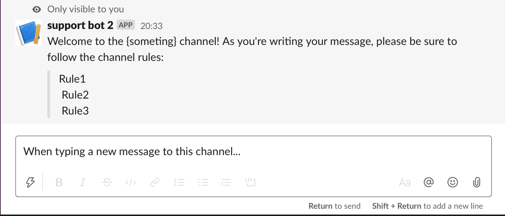

# Slackbot user-is-typing Message

A tiny slackbot to genlty remind people of the channel rules as they start typing in a channel.  The bot sends an "Only visible to you" message to each users who starts typing (by default once per day).

This is intended as more of a working example for you to build from than a finished project.




## Setup
```
git clone https://github.com/matt-parish/slackbot-user-is-typing-message.git
cd slackbot-user-is-typing-message
npm install
touch .env
```

Assuming you have a Slack workspace, account, etc.. and are logged in... 

1. Go to: https://api.slack.com/apps?new_classic_app=1, and fill out the form.  Note, this link doesn't seem to be readily available, but I was able to get it from the section "Appendix: creating a classic Slack app", at https://api.slack.com/docs/oauth#classic
2. When you get your app, go to "Add features and functionality", and select "bot".  You'll get taken to "App home", where you can select "Add Legacy Bot User", and fill out the form.
3. Go back to "Basic Information", and add install your app to your workspace.
3. Go to "OAuth and Permissions" , and grab the "Bot User OAuth Access Token", and stick it into the .env file, as per: `SLACK_BOT_TOKEN=xoxb-..... `
3. Finally, in your slack workspace, invite the bot to the channel you want them to monitor.


## Running the app
```
npm start
```

## Tests
For a future commit

## License
MIT
